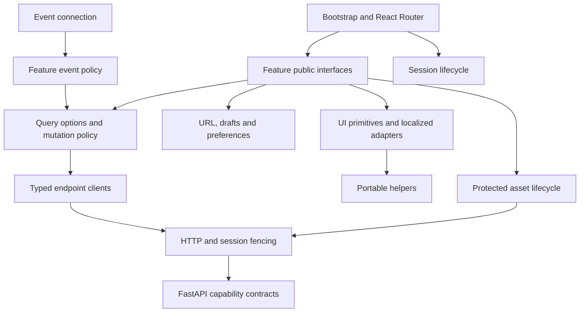

# Frontend target architecture

Status: proposed migration architecture, 2026-10-06. The current implementation
still contains legacy owners. The [plan](../frontend-architecture/plan.md) records
accepted product decisions and rollout order; the [review](../frontend-architecture/review.md)
distinguishes inspected facts from unfinished investigation. This document does
not claim these modules or guarantees have already shipped.

## Ownership and module interfaces

Keep React Router, Vite, React and TanStack Query. Use feature modules where a
workflow needs one owner for reads, writes, events and recovery; a directory move
without a changed contract is not an increment.

| Concern               | Owner / public interface                                                                                                                | Concrete problem resolved                                                                         |
| --------------------- | --------------------------------------------------------------------------------------------------------------------------------------- | ------------------------------------------------------------------------------------------------- |
| Route composition     | Existing `router.tsx` + thin `pages/`; validate route parameters and compose public feature exports.                                    | Pages no longer coordinate sockets, transport caches and forms together.                          |
| Session lifecycle     | `lib/session`: identity validation, session generation, begin/end lifecycle, private-resource cleanup.                                  | A delayed read, write response, asset or socket cannot act on a later session.                    |
| HTTP transport        | `lib/api/request`: typed error parsing, auth, cancellation, session checks, JSON/forms/actions/protected bytes.                         | Remove the second JSON freshness cache and transport knowledge of feature invalidation.           |
| Typed endpoints       | Existing domain endpoint files under `lib/api/`.                                                                                        | Keep actual HTTP/domain contracts explicit; no generic repository layer.                          |
| Feature remote state  | `features/<feature>/queries.ts`: key/options factories; `mutations.ts`: commands with declared affected reads.                          | Multiple surfaces observe one freshness/invalidation policy.                                      |
| Library navigation    | `features/library/url.ts`, `browse.ts`, `history.ts`.                                                                                   | One URL codec, one page order, one restoration policy for the nested scroll container.            |
| Event policy          | Event transport owns connections; feature adapters classify notices as read invalidation, controlled-refresh hint or authorized resync. | Events cannot independently install unvalidated private entity data or bypass stable-list policy. |
| Local operation state | Workflow controller where upload bytes, cancellation and retries have a lifecycle.                                                      | Client transfer progress does not get confused with the durable server Job.                       |
| Protected assets      | `lib/assets`: acquire/release, viewport admission, byte budget, cancellation and session disposal.                                      | Mounted images cannot lose their object URL to an unaware LRU.                                    |
| Shared UI             | Existing `@printstash/ui` primitives and app-level localized adapters.                                                                  | Preserve focus, overlays, tokens and motion without importing feature workflows into a package.   |
| Portable helpers      | Existing `@printstash/domain` pure formatting/domain helpers; app owns browser subscriptions.                                           | A package's environment assumptions remain explicit; no package split merely to rename it.        |

An options factory is justified when a read is observed, prefetched or updated
from multiple surfaces. Export the options/key contract, not a universal hook
that only forwards `useQuery`. Extract mutation coordination when list/detail
consumers need the same confirmed result. Keep a one-off endpoint or presentational
component simple.

## Proposed directory tree

```text
frontend/
  src/
    main.tsx                   # providers and bootstrap
    router.tsx                 # React Router composition
    pages/                     # route parameters and feature composition
    features/
      library/                 # browse, URL, history, collection actions
      models/                  # detail, artifacts, revisions, edit contracts
      multipart/               # sets, parts, choices, builds
      documents/               # reads and editing with draft ownership
      search/                  # text/image/search-result workflows
      similarity/              # comparison and review
      inbox/                   # pending imports and capture review
      tasks/                   # remote Jobs plus local transfer lifecycle
      printers/                # fleet, queue, live connection ownership
      profiles/                # printer/filament presets
      statistics/              # period-scoped read models
      settings/                # administrative feature composition
        storage/               # provider/capability-specific workflows
        backups/               # process state and explicit commands
        sources/               # discovery workflows
        identity/              # users/tokens/preferences
      access/                  # login/setup/public-share feature contracts
    lib/
      api/                     # transport and typed endpoint clients
      session/                 # identity/generation lifetime
      events/                  # connection and subscription lifetime
      assets/                  # protected-byte lifecycle
      preferences/             # browser preferences/subscriptions
    components/ui/             # localized application adapters
    types/                     # explicit shared API/domain contracts
  packages/ui/                 # reusable primitives, no application workflows
  packages/domain/             # portable helpers; explicit browser-only legacy seams
  tests/e2e*/                  # observable browser contracts
browser-extension/             # independent capture client and its API contract
```

Create a module only when its behaviour is migrated. Keep reusable domain enums
and DTOs at the lowest owner that has real consumers; do not duplicate them in
every feature or move all types into a new universal package.



Allowed imports flow toward lower-level contracts. Endpoint clients and transport
cannot import React, feature queries, components or routes. Workspace packages
cannot import app source. Feature internals cannot import route composition or
sibling internals: shared screens compose public interfaces, and shared DTOs live
at their actual common owner. Session and event infrastructure exposes lifecycle
signals without importing feature code; bootstrap wires cleanup and adapters.

Migrated boundaries are enforced by `frontend/tests/repo/dependency-boundaries.test.ts`
using the existing Oxc parser and a resolver for TypeScript aliases and workspace
exports. The [boundary contract](../frontend-architecture/dependency-boundaries.md)
names the public feature modules and the single legacy transport-invalidation
exception. The gate checks type-only, static, re-export, literal dynamic and worker
imports, reports runtime and type-involving strongly connected components separately,
and fails on unresolved computed imports for explicit review. Unused exceptions
fail too. This is dependency-direction enforcement, not a claim that every legacy
owner has migrated; no ESLint or new build framework is required.

## State ownership

| State                                                               | Source of truth                                                  | Lifetime / rule                                                                                                       |
| ------------------------------------------------------------------- | ---------------------------------------------------------------- | --------------------------------------------------------------------------------------------------------------------- |
| Server entities, lists, counts, capabilities, remote process status | Feature-owned Query entries backed by authorized endpoints       | One cache, complete keys, declared invalidation. No transport JSON TTL.                                               |
| Collection, filters, sort, library mode, selected route entity      | URL                                                              | Parse/normalize once. URL wins over preference; preference supplies an absent initial default only.                   |
| Form draft and base edit version                                    | Editing feature                                                  | Preserve dirty values across refetch/errors; explicit conflict resolution. Never persist secrets as a convenience.    |
| Selection, open modal, hover, active local tab                      | Nearest owning component/workflow                                | Clear or reconcile when its view identity changes.                                                                    |
| Locale, theme, grid preferences                                     | Preference owner                                                 | Shared subscription; validated/versioned persisted values. Private preferences are scoped and cleaned appropriately.  |
| Displayed library ordering                                          | Query data for that view/session + bounded presentation metadata | No second indefinite entity cache. Freeze ordinary external reordering until refresh; patch confirmed own actions.    |
| History position                                                    | Entry-keyed restoration metadata                                 | View identity, entity anchor, relative offset and fallback pixel position; no private entity payload in localStorage. |
| Upload bytes, local retries and local cancellation                  | Transfer controller                                              | Separate from the server Job; dispose explicitly.                                                                     |
| Authenticated image/preview blobs                                   | Asset lifecycle                                                  | Session-bound bytes and leased object URLs; bounded idle memory.                                                      |

Library view identity includes normalized URL inputs and validated session context.
History entry identity is distinct: two visits to the same URL can have different
positions. Keep a session epoch as well as user identity; logout/login to the same
account still invalidates old async work. Clearing Query alone does not stop a
late mutation callback or body reader.

## Queries, mutations and events

Keys include every response-shaping input: scope, filters, sort, page size and
permission/session partition where appropriate. Normalize set-valued filters.
Cursor is `pageParam`. Forward Query's AbortSignal to the actual fetch/body work;
classification of abort must not log a user-visible failure. Session generation
must be checked before any result publication or unauthorized-response handling.

Maintain the existing general freshness defaults unless the feature has a reason
to differ. Library browse is such a reason: automatic focus/reconnect refetch must
not silently reorder the displayed infinite list. Revalidate its revision and
show available changes instead. Queries outside that stable-list contract can
continue ordinary background revalidation. Permission/auth failures bypass it.

Guard continuation against any in-flight list fetch, not only `isFetchingNextPage`.
Use `cancelRefetch: false` as appropriate to avoid replacing an active refresh;
it is not a parallel-fetch strategy. Retain existing pages after continuation
failure, and provide Retry separately from an empty-success state. On a stale
browse revision, offer Refresh; do not retry an invalid cursor automatically.

A mutation establishes a boundary for older reads before writing. After server
confirmation, publish its authoritative result to relevant existing Query entries
before showing success. Cancel/reconcile reads that started earlier, including
reads started while the write was pending. Version-aware reconciliation prevents
an older body from replacing a confirmed edit. Serialize conflicting operations
per entity or reject duplicate submissions; do not serialize unrelated entities.

Keep ordinary external changes, confirmed own changes and permission changes
explicitly distinct. In Favorites, a confirmed unstar removes the card without
rebuilding unrelated pages; if it invalidates the browse revision, continuation
requires refresh. A full-list rollback must not undo another successful mutation.
Where optimistic UX is justified, roll back only that operation's owned fields.
The selected favourite-removal policy itself is confirmation-first.

Keep invalidation in feature mutation/event policy. During migration one clearly
owned compatibility adapter can translate legacy successful writes into affected
keys; remove it after its last consumer. Do not maintain two independent policies
for a migrated endpoint.

Source editing is owned by `features/library/provenance.ts`. The provenance DTO
contains its Model editing version and nullable cover metadata; components must
not pair it with a later version fetched independently to authorize a write.
Freeze the field/cover command at the user's gesture. Conflict or unknown outcome
retains that command and requires fresh Model/Source reads with matching versions
before explicit retry. Permissions come from that reviewed Model. Source
acknowledgements retire earlier reads; cover image cache identity follows the
returned cover metadata, while all bytes still use authenticated asset leases.
The Source endpoint clients require a version; no transport cache or generic
form/repository layer is added. See [the Source validation record](../library-provenance-editing-validation.md).


Lightweight outliner Model/Multipart entries carry their stored editing version
alongside name and location, including search and continuation pages. Collection
search matches are a distinct unversioned case. A move must carry the version
captured from its source gesture; fetching a current version just to authorize a
stale move defeats conflict detection. The read contract is qualified in
[the movement validation record](../library-move-validation.md); the remaining
unconditional drop handler is still an explicit M4 migration gap.

Multipart detail publication stays in `features/library/multipart.ts`. Composition,
tag and cover writes use conditional versions; their endpoint clients reject a
receipt for another aggregate or a non-advancing version. The shared tag editor
accepts an optional review capability, whose commands the Multipart caller binds
to a fresh authorized snapshot. Cover recovery retains its File/delete intent in
the existing detail review flow. Auxiliary confirmation updates only its owned
fields in an open composition draft; it advances that draft's base only when the
command used that same base. Reviewing an auxiliary edit never silently rebases
unrelated input. Cancelled editor signals also fence receipt publication.
See [Multipart qualification](../library-multipart-validation.md).

Events are hints to obtain authorized state. Reconnect resync must recover missed
notices; socket generation/disposal prevents late-ticket connections from reviving
a dead subscription. Browser focus and offline recovery are part of the same
feature lifecycle. Preserve command-specific polling where completion controls the
next action; consolidate duplicate remote readers rather than banning all timers.

## Route, loading and recovery contracts

Use the existing route structure and URLs. Preserve same-origin cookies, public
share isolation, setup/auth gates, history and return destinations. Reject unsafe
external return targets. Replace invalid/retired query values canonically without
adding a history entry. Route navigation remains unanimated under DESIGN.md.

A library transition renders one coherent source or destination snapshot: heading,
folder breadcrumbs, outliner context and cards agree. While showing a prior
snapshot, actions cannot accidentally target the destination URL. An error keeps
a recoverable state with clear scope; it cannot masquerade as an empty collection.

Distinguish initial loading, empty success, initial failure, background failure,
continuation failure and conflict. A stale result may stay visible only when its
session/permissions permit it. A recoverable chunk error offers reload with draft
loss considered; repeated automatic reloads are not recovery. PWA handles static
shell/assets only according to the existing contract; never cache private JSON
or authenticated bytes across identities by accident.

Restore the actual `main` scroll container only after matching list data/layout
are ready. Prefer entity anchor plus offset, then bounded fallback. Cache eviction,
changed viewport, a deleted anchor and session loss each need an explicit outcome.
Do not add private Query persistence simply to preserve navigation within a tab.

## Existing-to-future owner map

| Current responsibility                                      | Future owner / mechanism to remove                                                                               |
| ----------------------------------------------------------- | ---------------------------------------------------------------------------------------------------------------- |
| `components/model-grid.tsx` merge, sort, membership         | library browse + authorized server page; delete local mixed ordering and group downloads.                        |
| model-grid URL state / history listeners                    | library URL codec + React Router location; remove synchronized mirrors.                                          |
| model-grid settled view / detail return                     | library presentation/history; preserve coherent snapshots without a permanent duplicate cache.                   |
| `components/model-card.tsx` StarOverride                    | library mutation policy; all surfaces receive confirmed state.                                                   |
| `lib/queries.ts` and central path invalidation              | owning feature options/mutations; keep shared catalogs shared.                                                   |
| saved-view effect / `document-browser.tsx` loaded documents | feature Query entries; draft/local selection remain local.                                                       |
| `bottom-nav-bar.tsx` and Inbox refresh                      | shared Inbox key/lifecycle.                                                                                      |
| `lib/task-center.ts`                                        | tasks remote reads + preserved local transfer protocol.                                                          |
| printer-detail WebSocket effect                             | printers live connection with owned cancellation/disposal.                                                       |
| `settings-panel.tsx`, storage/provider panels               | settings workflow owners, draft forms and remote Job queries.                                                    |
| asset cache / thumbnail hooks                               | leased, bounded, session-aware asset owner.                                                                      |
| `lib/navigation.ts` and link no-ops                         | explicit React Router navigation and real feature prefetch/restoration; delete misleading compatibility options. |
| package browser preferences and app wrappers                | explicit app preference subscriptions; retain proven package helpers and UI primitives.                          |
| extension capture/auth clients                              | independent extension boundary, tested against FastAPI; do not import the web app's Query cache.                 |

## Implemented Model movement owner (M4)

`features/library/moves.ts` owns conditional Model movement and its recovery.
Native cards/list rows and paginated outliner leaves capture a Model's displayed
version and session at drag start. Drop targets supply the intended collection;
they never fetch a newer version to authorize an older intent. `lib/model-dnd.ts`
validates native DataTransfer input and rejects id-only or retired-session drags.

The owner permits one outstanding intent per Model and concurrent independent
Models. A412 or uncertain response retains the original destination. Only an
explicit authorized read enables a reviewed retry or adoption of the current
location. `components/model-move-review.tsx` presents this state using shared
primitives; it owns no server cache. Confirmation cancels an obsolete detail read
before version-ordered publication and coordinated Library refresh. Navigation,
unmount and session retirement fence publication and abort outstanding reviews.
Every first-party `updateModel` call now requires its editing base.

## Contributor conventions and tests

Tests live beside the behavioural owner under `__tests__`; packages test their
public interfaces. Frontend component tests use the real router, Query and
transport with controlled fetch responses. Browser tests own real scroll, navigation,
viewer/worker and PWA delivery behaviour. Backend integration tests own filtering,
permissions, versions and persistence using real SQLite and relevant Postgres
cases. Architecture tests own dependency directions, not filenames or file sizes.

Before adding an abstraction, identify the duplicated lifecycle or invariant it
owns, its public inputs/outputs and the old mechanism removed. A forwarding wrapper,
file split or a universal repository is not a sufficient reason. Production work
ships with the repository's behaviour matrix and applicable tests in the same PR.
Update this document's migration status as owners actually move; do not document
a proposed guarantee as available behaviour.
