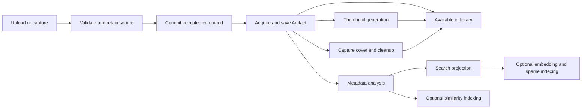

# Ingestion and background enrichment

An import has two completion boundaries: the source is saved, and its optional
representations are ready. A saved Artifact remains downloadable and usable when
its preview or search index is pending or has failed.

## Work required before success

| Stage | Why it belongs before source completion |
| --- | --- |
| Authentication and target authorization | Retain the actor and destination, then check current permissions again during execution and source publication. |
| Upload validation, limits and staging receipt | Workers must own the exact bytes they will consume. |
| Hashing and duplicate detection | Source identity determines deduplication and replay. |
| Minimal G-code compatibility metadata | Print safety and revision selection need these facts immediately. |
| Storage publication, Artifact metadata and provenance | Success promises durable source bytes and their library identity. |
| Registering derivative requests | Recovery must not depend on an in-memory callback after commit. |

Geometry analysis, mesh parsing for previews, image normalization, profile
extraction, capture covers, lexical projection, embeddings and similarity work
are background stages. Thumbnail failure does not change source import success.

## Ownership and recovery

`modules/ingestion/commands.py` persists versioned commands with accepted jobs.
`command_executor.py` dispatches their handlers separately, so the durable store
and publication fences do not depend on ingestion implementations.
The local dispatcher claims one command with an expiring token and renews its
lease during execution. Restart reconciliation preserves replayable commands.
Artifact ingestion keys and stable archive, selection and G-code revision keys
make source replay idempotent. Storage cleanup uses exact ownership receipts.
Resumable upload finalization commits the job, command, staging receipt and
upload binding together. A later audit failure cannot lose that handoff.

`AcquisitionJournal` checkpoints resolved source lists and exact download
receipts in the command transaction. Selections download and save one source
at a time. After a restart, completed child results are reused and temporary
bytes are trusted only while their recorded filesystem identity still matches.

Private review manifests live in SQL, expire after one hour, and retain owner
identity across restarts. Selecting files or collection members consumes the
manifest in the command transaction. Archive selection transfers its staging
receipt; concurrent claims cannot both accept the archive.

`ArtifactAnalysisGeneration` owns metadata readiness. `ThumbnailGeneration`
owns preview readiness. Both identify the source hash and output recipe, claim
work independently, and fence publication against stale ownership and source
changes. The enrichment processor shares a materialized source and mesh parse
when both outputs are due. Compute permits and filesystem capacity reservations
bound admission. Heartbeats retain permits during long calculations.

Capture enrichment is registered with source acceptance and waits for its
source job. Covers and cleanup are retryable independently from saved files.
Workers drain their active unit during shutdown; infrastructure failures leave
work recoverable in SQL. A source command can contain an entire selected batch,
so graceful shutdown can wait for that batch. An interrupted process resumes
unfinished items and retains committed sources. The import API has no separate
operator cancellation operation.

New source work gets scheduling preference, with a
60-second age limit so continuous intake cannot indefinitely starve metadata,
previews or similarity analysis. Active calculations retain their compute
permit until publication or cleanup.

This is local-first infrastructure. It requires neither Redis nor a broker.
The runtime controls scheduling; capability modules own transactions, claims and
outputs. `WorkWakeup` remains a scheduler hint, not a durable queue. Storage and
session interfaces remain explicit for remote providers and other runtimes.

## Search

A content transaction coalesces source identities into
`SearchProjectionRequest`. The search worker expands affected subjects in bounded
pages, with persisted cursors and revision checks. Passage construction and
lexical indexing happen outside the source transaction. Dirty passages are
excluded from retrieval until refreshed; current access checks remain mandatory.
Embedding, sparse and similarity indexes retain their separate owners.

## Readiness and operator policy

File responses include independent metadata and thumbnail states. Model list
and detail responses report whether enrichment is pending; the web client polls
while it is pending. Editors can request or retry enrichment through
`POST /api/v1/files/{id}/enrichment`.

`VAULT_THUMBNAIL_PROCESSING` accepts `background` (default), `on_demand`, or
`disabled`. This controls scheduling without making previews mandatory for
source success. G-code without an embedded preview reports `not_applicable`.

## Native computation

Rust handles supported mesh loading, triangle measurements, rasterization,
connected components, weighted normal accumulation and closest-surface queries
used by similarity verification. Immutable input buffers
and detached native computation release Python's interpreter lock. Prepared
geometry and normals are reused across multiple views. Python retains network,
transaction and scheduling coordination.

Similarity verification constructs an immutable native bounding-box tree and
queries it outside Python's interpreter lock. Queries retain a hard triangle-test
budget and return exact face, edge or vertex projections. Installations without
the new kernel retain the Python implementation; the core API can explicitly
select it with `SurfaceProximity(surface, native=False)` for comparison.
The analysis boundary converts third-party tracked arrays to plain numerical
arrays before creating owned analysis copies, so registration does not inherit
the mutable source model's cache hooks.

Mesh loading, geometry measurements and rendering use the required Rust engine.
The former Python engine-selection settings have been removed.

## Measurement

`backend/scripts/bench_import.py` records source completion separately from
background completion, resource use, generated geometry and preview output.
Comparisons must use the same input bytes, renderer settings, concurrency and
navigation probes. Moving work to the background reduces time to availability;
it does not imply less total CPU work or shorter time to complete every index.
